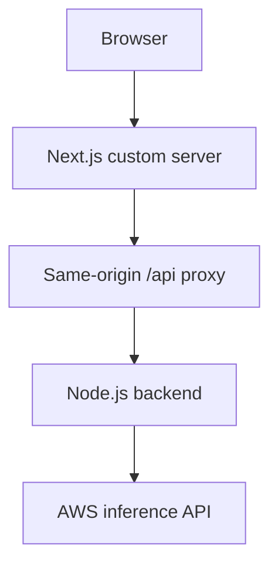

# MedicAI frontend — course-based ML application

Next.js and React interface for the MedicAI image-classification learning project. **Original application: Patrik Szepesi.** The upstream layout, application screens and model integration originate from his Udemy course.

## Request flow



The proxy keeps browser authentication on a single origin. This fork makes the backend origin configurable, retains the proxy in production mode and adds a `/healthz` endpoint and bounded upstream request times.

## Run locally

Start the backend and MongoDB first. Then:

```bash
cp .env.example .env.local
npm ci
npm run dev
```

Open `http://localhost:8080`. `API_ORIGIN` defaults to `http://localhost:8000`; the browser uses relative `/api` requests. If the backend runs in a container, set `API_ORIGIN` to its service address from the frontend container's network, not the browser's address.

For a production-mode application build:

```bash
npm run build
npm start
```

The production start script must use the custom `server.js`, because direct `next start` does not include this proxy. A TLS terminator or ingress should sit in front of the application in a deployed environment.

## Configuration

| Variable | Meaning |
|---|---|
| `NEXT_PUBLIC_API` | Public relative API path; not a place for credentials |
| `API_ORIGIN` | Backend origin used only by the server |
| `PORT` | Frontend listening port, default 8080 |

## Operational checks

`GET /healthz` verifies that the Next.js server has prepared; it does not assert backend, database or model availability. A proxy connection failure returns 502. Inference latency should be measured at the backend and model integration as well as the browser.

The inherited Next.js 11 / React 17 dependency set is legacy. Dependency modernization, browser tests, authentication/CSRF validation and a full image-upload smoke test remain required before public deployment. Current CI checks custom-server syntax only; a successful syntax job is not evidence of a working end-to-end application.

## Attribution

[Upstream frontend](https://github.com/patrikszepesi/MedicAIFrontEnd) · [Upstream backend](https://github.com/patrikszepesi/MedicAIBackEnd) · [Course](https://www.udemy.com/course/build-and-deploy-a-ml-model-to-production-with-aws-and-react/)

The notebook and inference system are learning assets. Use synthetic or public benchmark inputs for a portfolio demonstration.
